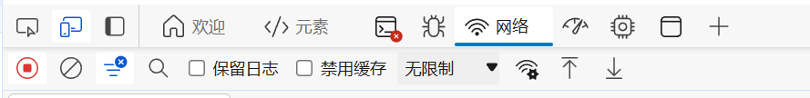
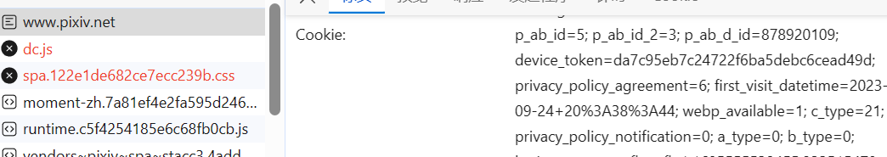
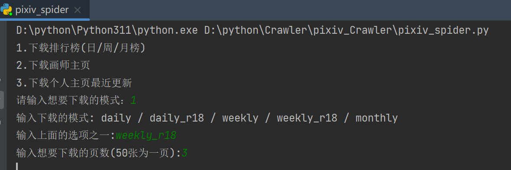
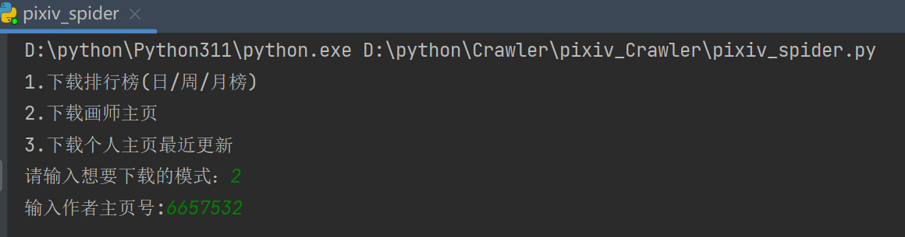
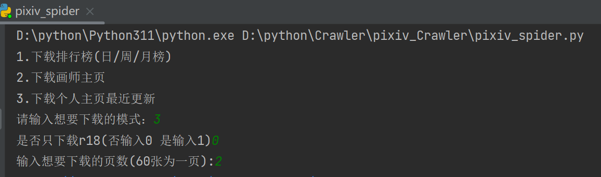
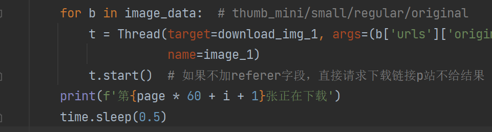

# pixiv_Crawler

## 首先填充cookies(没填充无法运行)

进入pixiv网址<https://www.pixiv.net/>，然后登陆你自己的账号。

F12打开开发者模式，点击网络，在最上面的www.pixiv.net往下滑动。

我这里cookie截图只截看一部分，完整的cookie会很长，全部复制就行了。

把cookie复制到download.py里的第8行的headers里面。
---

### 运行pixiv_spider，会出现提示让你输入三种下载模式。

## 第一种：下载排行榜

注意不要输错字了。~~r18是什么，我是觉得大家都明白的~~。输入页数是下载的个数，如图输入3，会下载排行榜前3*50=150位的图。

下载后按照 排行榜排名进行排序1，2，3这样。

## 第二种：下载画师主页

输入的主页号的意思就是进行画师主页，url中的有一段数字。应该不难找，就不上图了。

会下载画师的全部作品，排序按作画id默认排序就行。

## 第三种：下载作个人主页最近的更新

懒虫用的，比如我。

~~还没有只下载非r18的功能。不过你可以去网页中先手动关闭r18的显示，再来下载，这个功能就实现了~~。

---

## 其他说明：
1. 图片名称中的数字就是作品id，id越大代表图片越新(时间)
2. 想要查找下载图片出处时，只需要把作品添加到下面的url后面就可以去到原图片出处了。
>https://www.pixiv.net/artworks/ 如 https://www.pixiv.net/artworks/89937761
3. 多线程报错问题(比如下面这样的)，由于在学校的时候网速很快没有出现这种错误。但是回家后网速更不上下载速度导致报错。
>(Caused by SSLError(SSLEOFError(8, 'EOF occurred in violation of protocol (_ssl.c:992)')))
>
> 可以动态调整下面的time.sleep中的时间，如果网速快可以注释，如果网速慢，建议停得久点。
>>
